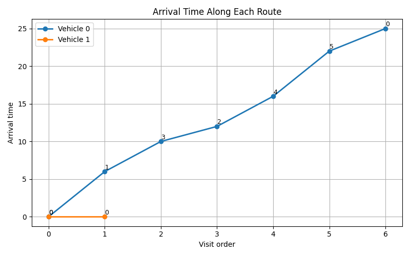
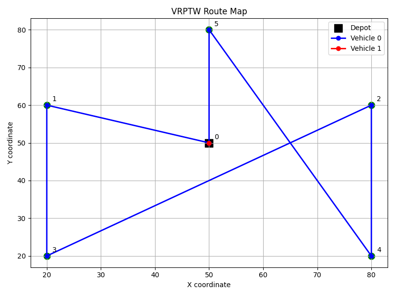

### Week 2 — 2026-06-15

**Attended this week's meeting:** Yes

**Progress this week**
- Built the first OR-Tools VRPTW baseline and ran a feasible routing example successfully.
- Learned the basic structure of OR-Tools, including the roles of data model, RoutingIndexManager, RoutingModel, callback, dimension, and search parameters.
- Gained a basic understanding of key OR-Tools syntax and workflow, such as registering transit callbacks, setting arc costs, adding a time dimension, and extracting routes from the solver output.
- Extended my own Python baseline toward EVRP-TW by adding battery capacity, energy consumption, charging stations, and a simple full-recharge rule.
- Tested a small toy EVRP-TW instance and confirmed that charging-station logic can already affect route feasibility.
- Continued comparing the modeling difference between a hand-built heuristic baseline and a solver-based OR-Tools baseline.

**Challenges & blockers**
- I am still not fully comfortable with the internal logic and syntax of OR-Tools, especially concepts such as dimensions, cumulative variables, and index conversion.
- It is still unclear how far I should continue developing my own routing logic versus switching more fully to OR-Tools.
- My current EVRP-TW extension is still a simplified prototype and does not yet include all target elements in a unified framework.

**Next steps**
- Refine the OR-Tools baseline and gradually add the important missing elements needed for EVRP-TW-style modeling.
- Continue learning the core OR-Tools concepts and syntax so I can understand and modify the baseline more confidently.
- Keep extending my own EVRP-TW prototype to include more complete problem elements and clearer feasibility checks.
- Compare the advantages and limitations of the OR-Tools baseline and the self-built EVRP-TW prototype.
- Decide on a practical development direction for the next stage: solver-centered implementation with a custom prototype as support.

**Hours spent (optional):**
15

**Links (optional):**
Ortools: `src/ortools_vrptw_baseline.py`
Ortools with visualization: 

Evrptw with only battery: `src/ortools_vrptw_baseline.py`
Evrptw with battery and charge stations: `src/ortools_vrptw_baseline.py`
Meeting note: `2026-06-16`